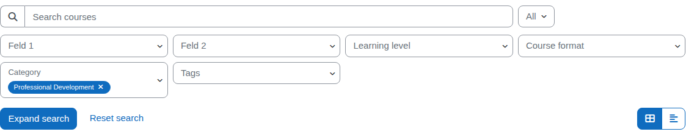
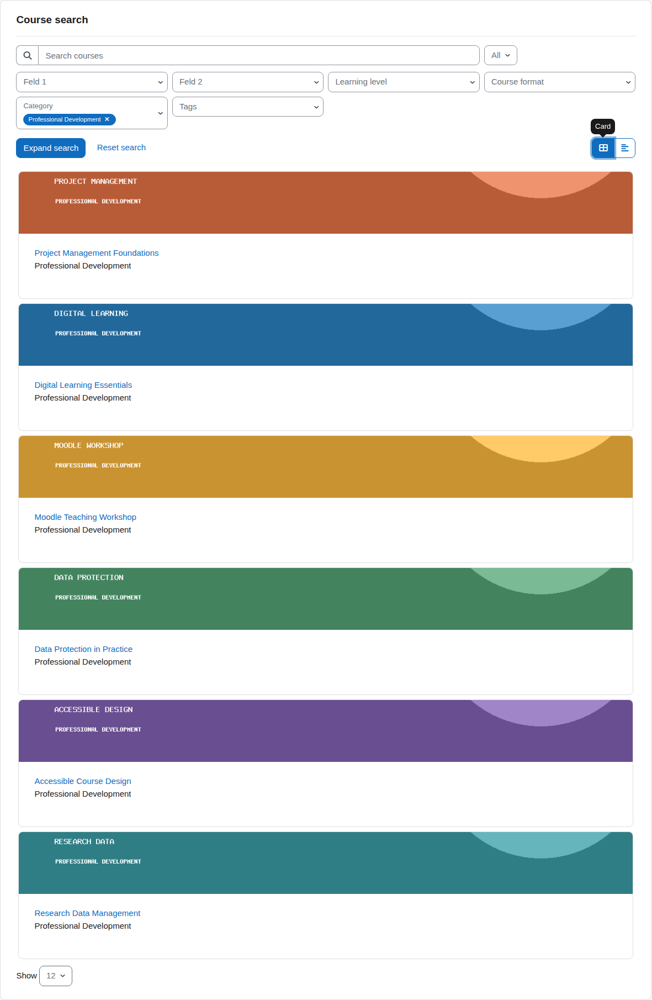
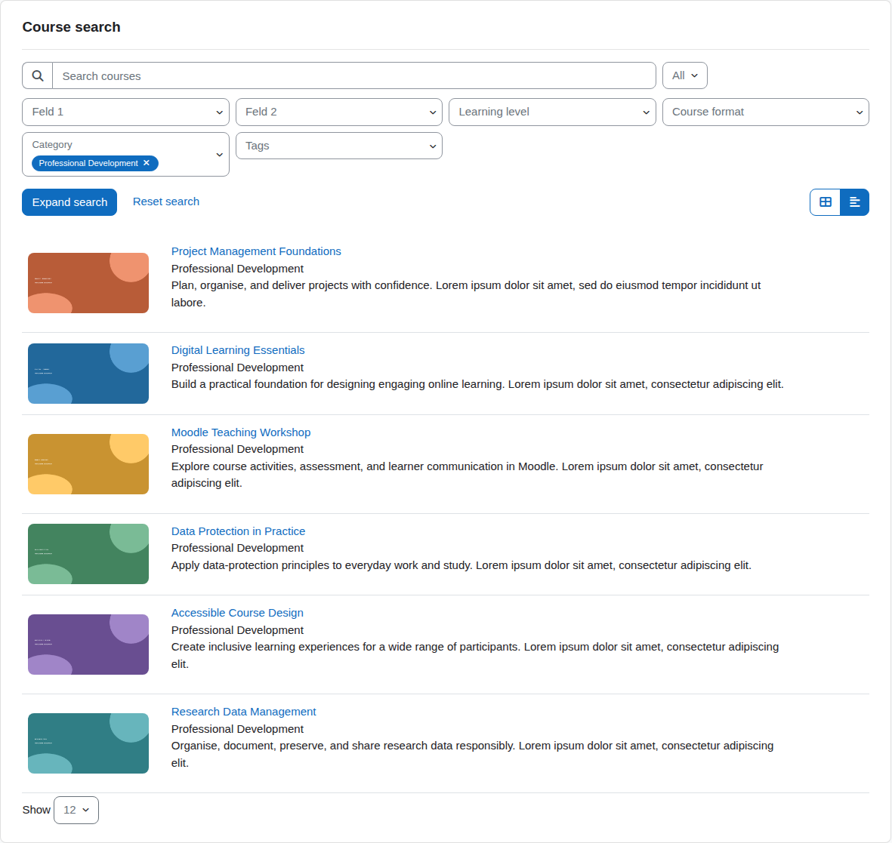
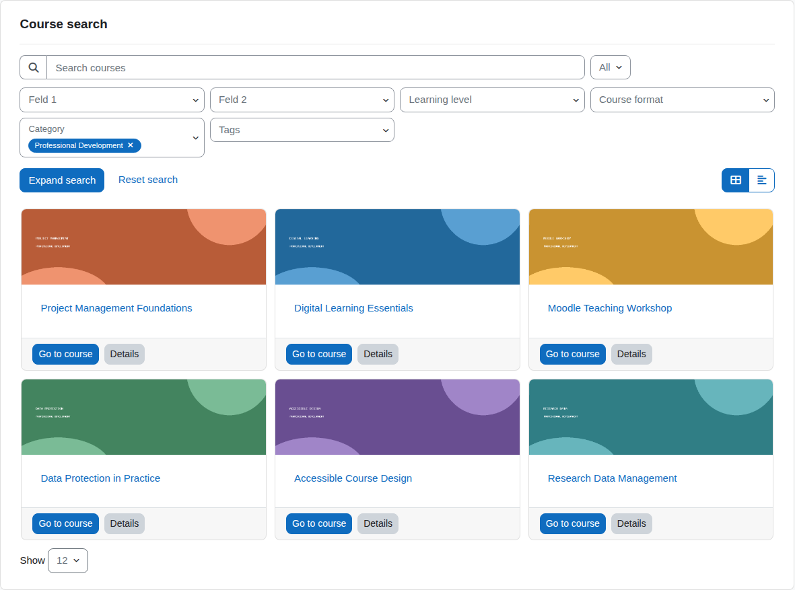
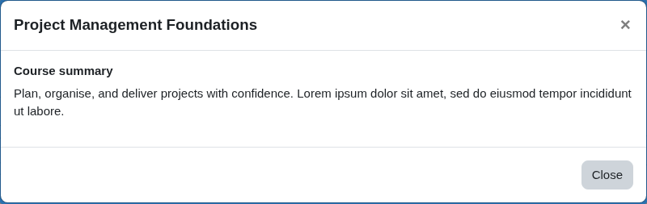

# User instructions

Course search is a block which lets you search courses for the following criteria:

- Full-text search of course name and description  
- Course category  
- If the course is over, ongoing, or planned for the future  
- Course custom fields  
- Tags  

You can choose between two result formats: list and cards.  

The searchable dropdown fields allow multiple selections and constrain each other.  
That means: If you select something in one field, the other fields will only show valid selection options which will return results.

The plugin consists of two main sections:  

- Search section  
- Results section  

## Search section

### Using the searchable dropdown fields

1. Click on a field  
   - A dropdown opens with a fixed number of options.  
   - Custom select fields will additionally display a description at the top if there is one available.

2. To see other options, type a search term into the search box. The options list will update after a moment.  
   - The options list is divided into a section with selected items and one with items available for selection.  
   - To clear the search field, click the "x" symbol on the right.

3. Select an item by clicking on it. The item will appear in the selected items section.  
   - To unselect an item, click on it again.  
   - The results section of the plugin will update immediately.

Depending on the number of available search fields, there might be an **Expand search** button to reveal additional fields.

If enabled by the administrator, selected filters are displayed as removable
pills inside the filter fields or in a separate area above or below the search
fields. Individual pills can be reached with the keyboard and removed with
<kbd>Enter</kbd> or <kbd>Space</kbd>. Use **Clear all filters** to reset the
complete search.

### Full-text search

The full-text search applies the search term to the course name and description.  
It may show a "No results" page.

## Results section

This section contains the search results either in list form or in card form, which displays the found courses.  

The card view presents each course with its image and key information:

The list view displays the available course summary directly:

At the bottom, paging controls let you move through the results when there are
more courses than fit on one page.

### Boost Union presentation

When the administrator enables the Boost Union course listing style, cards and
lists follow the theme's course-listing settings. Depending on the theme
configuration, the results can include course images, categories, progress,
enrolment information, and a **Details** dialog.

## Excluding courses from the search results

You can exclude courses from the search results by creating a custom course field with the type "Checkbox" and the
shortname `block_eledia_coursesearch_visible`.

Any course that has this custom course field and has it set to "No" / unchecked
will be excluded from the search results regardless of any other search
criteria.
